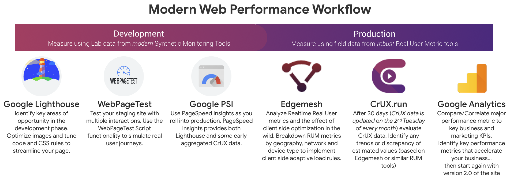
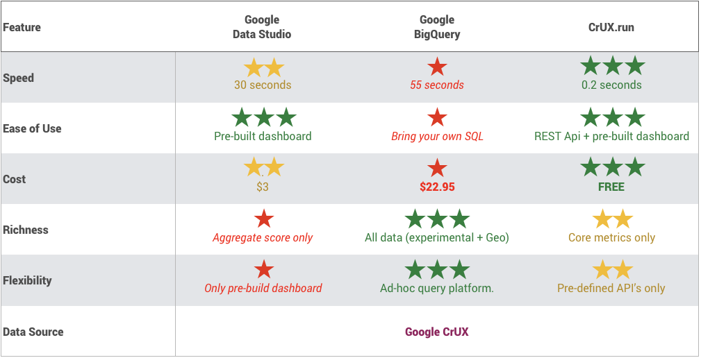
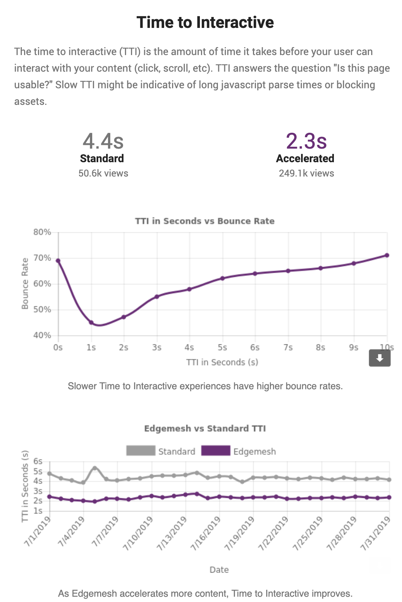

# A Brief Introduction to CrUX.run

The Chrome User Experience Report (CrUX) provides real world , real user metrics gathered from the millions of Google Chrome users who load billions of websites (including yours) each month. It is _this_ data that helps Google determine how fast your website is , and helps [Google determine Search and Ad rankings](https://www.searchenginejournal.com/mobile-page-speed-changes/272221/) for your site. 

In 2018, Google provided acccess to the public access to the CrUX data using their large scale database BigQuery. At this point you may ask - given that BigQuery and the CrUX.run platform both contain the _exact_ same data from Google - why did [we](https://edgemesh.com/?utm_source=crux.run&utm_medium=tools) go through the (fairly large) engineering effort to develop CrUX.run? 

## Why we created CrUX.run:

1. Google's BigQuery database was too slow (55 seconds per site)

2. Google's BigQuery database was too expensive ($25 per customer analysis)

3. Aggregated data tools like Page Speed Insights or GTMetrix did not provide enough detail (Aggregated or No real user metrics included)

4. We wanted to help our customers using [Edgemesh](https://edgemesh.com/?utm_source=crux.run&utm_medium=tools) to see the <i>real</i> impact of our software by pulling data directly from Google's database without having to use BigQuery.

And thus ... CrUX.run was born. 
We hope you find CrUX.run helpful, and we look forward any [feedback](https://github.com/edgemesh/crux/issues)!

:wave: 
The Edgemesh Team  

PS: If you ❤️ CrUX.run, kindly let us know 
<a href="https://twitter.com/intent/tweet?screen_name=edgemeshinc&ref_src=twsrc%5Etfw" class="twitter-mention-button" data-text="Thanks @edgemeshinc for https://CrUX.run. #WebPerf" data-show-count="false">Tweet to @edgemeshinc</a>

®2019 Edgemesh Corporation: [Faster Website Experiences That Accelerate Your Business](https://edgemesh.com/?utm_source=crux.run&utm_medium=tools)

The Chrome User Experience Report datasets provided by Google are licensed under a [Creative Commons Attribution 4.0 International License](https://creativecommons.org/licenses/by/4.0/).

# Measure like Google: what is CrUX?
Testing your website's speed with traditional audit platforms (GTmetrix, WebpageTest.org and Google Lighthouse) is a great way to help guide the development of your site and identify oppertunities to improve performance before you go live. These _synthetic_ user metrics or _lab_ metrics provide deep, detailed analytis of page performance in a _controlled_ setting. But the internet is a complicated place and your website may not load the same at the same speed on every network, across every device or in every geography. 

In short, you need _real_ user metrics from real customers in the _field_  to understand the _actual_ page performance in the wild. 
See [common myths about performance](https://developers.google.com/web/fundamentals/performance/speed-tools/) from Google for more details.

## Synthetic Page Tests (Lab Data)
When Google changed their algorithm to prioritize speed as a ranking factor, they developed [Lighthouse](https://developers.google.com/web/tools/lighthouse/) to provide developers with a unified _synthetic_ testing tool to help identify and fix performance impacting issues in the lab. Lighthouse is a sophisticated page speed analysis tool that powers many of the modern page testing sites such as [Think With Google](https://thinkwithgoogle.com/feature/testmysite), [Page Speed Insights](https://developers.google.com/speed/pagespeed/insights/) , [Web.dev](https://web.dev/measur) , [SpeedCurve](https://speedcurve.com/?utm_source=crux.run&utm_medium=referral) and [Edgemesh's free website test](https://promo.edgemesh.com/speedmatters?utm_source=crux.run&utm_medium=tools).

## Real User Metrics (Field Data)
Lab results are great for development - but for search rank [Google uses _real_ user metrics gathered from Chrome based visitors in the field](https://developers.google.com/web/updates/2018/07/search-ads-speed). This data set is known as the [Chrome Real User Experience dataet (CrUX)](https://developers.google.com/web/tools/chrome-user-experience-report/).

>CrUX is powered by the millions of real user measurements of key user experience metrics across the public web, aggregated from Google Chrome users who have opted-in to syncing their browsing history (which is enabled by default), have not set up a Sync passphrase, and have [usage statistic reporting](https://www.google.com/chrome/browser/privacy/whitepaper.html#usagestats) enabled (also enabled by default). 
 [Source - Google®](https://developers.google.com/web/tools/chrome-user-experience-report/?utm_source=edgemesh&utm_medium=crux.run) 
 

 The CrUX dataset is available on [Google BigQuery](https://web.dev/chrome-ux-report-bigquery?utm_source=crux.run). If you have arrived here, you have likely seen Google BigQuery and decided there must be an alternative. If you would like to dive into BigQuery and CrUX directly, we recommend this [overview from Google](https://web.dev/chrome-ux-report-bigquery) . 
 >NOTE : You will need an active Google Cloud account with active credit card to use CrUX and BigQuery.

## When to use Synthetic vs. Real User Metrics
Synthetic audit tools play a valuable role during the development and tuning of a website. Real User metrics on the other hand provide the source of truth for the _actual_ performance of your site. 

The diagram below shows our approach to modern web development and the tools we employ as we move from 'development' to 'deployment' to 'production'. As the website becomes more real (going live with real customers) we move from more details but synthetic lab results and towards real field based metrics. We then ensure we tie back the _actual_ impact on the key business metrics. This is how we help customers [Accelerate their business](https://edgemesh.com/utm_source=crux.run), not just their website.

# BigQuery vs. CrUX.run 

Now that you know when to use real and synthetic data, you should also learn where you can find your real data. You can find real data in Google’s BigQuery database, Google Data Studio or CrUX.run. In order to help you evaluate if CrUX.run is right for you, the table below compares analyzing CrUX data in:

1. Google Data Studio - such as [CrUX Dash](g.co/chromeuxdash) 
2. Google BigQuery , the default platform
3. Crux.Run 

For this comparison we evaluated each platform using:
-  **1 Site**: A single origin (e.g. www.reddit.com)
-  **Over 6 months**: Real user metrics from CrUX over 6 months of data (_e.g. chrome-ux-report:all.201901 ...  chrome-ux-report:all.201907_)
-  **Full Detail of 3 Key Metrics**: Analyzing / extracting only the 3 key performance metrics of First Paint, First Contentful Paint and DOM Content Loaded. 

This is the same criteria / query set that powers the https://crux.run dashboard.

# CrUX Key Metrics 

Now that you know that you need CrUX data to measure your site’s performance, how do you determine which metrics are most important? Ask yourself “What does it mean to have a fast site?” “Fast” is a vague term. What exactly do we mean when we say fast? In what context? 

>It's common to hear people talk in terms of their website loading in x.xx seconds or similar, but a load is not a single moment in time; it's an experience that no single metric can fully capture. There are multiple moments during the load experience that can affect whether a user perceives it as 'fast', and if you just focus solely on one, you might miss bad experiences that happen during the rest of the time.
>
>Rather than measuring load with just one metric, you should time each moment during the experience that affects the user's perception of load speed. When a user navigates to a web page, they're typically looking for certain types of feedback: 
 [Source - Google®](https://developers.google.com/web/tools/chrome-user-experience-report/?utm_source=edgemesh&utm_medium=crux.run) 
 

For marketing teams these key "User Centric Metrics" map directly to key performance indicators. Below are some generic mappings of the CrUX performance metrics to their Marketing KPIs.

| UX Question 	| Performance Metric 	| Marketing Metric Impact 	|
|------------------	|------------------------	|-------------------------	|
| Is it happening? 	| First Paint 	| [Bail Rate](https://blog.edgemesh.com/?utm_source=crux.run&utm_medium=tools) 	|
| Can I see it? 	| First Contentful Paint 	| [Bounce Rate](https://blog.edgemesh.com/?utm_source=crux.run&utm_medium=tools) 	|
| Is It Useable? 	| DOM Content Loaded 	| [Conversion Rate](https://blog.edgemesh.com/?utm_source=crux.run&utm_medium=tools) 	|

Below is an example of how these User Centric measurements might look for an actual page load. 

Using the chart above, you can look at certain performance metrics to further analyze marketing KPIs. For example, if you wanted to investigate your bounce rate, you would look at your first contentful paint metric.

### Time to Interactve (TTI) : Missing from CrUX
The CrUX database unfortunately does _not_ include on of the most valuable metrics - the [Time to Interactive metric (TTI)](https://blog.edgemesh.com/?utm_source=crux.run&utm_medium=tools) . If you’d like to measure your time to interactive, you can sign up for [Edgemesh](https://portal.edgemesh.com/?utm_source=crux.run&utm_medium=tools). Edgemesh customers can access this data via the [Edgemesh portal](https://portal.edgemesh.com/?utm_source=crux.run&utm_medium=tools) and additional advanced Real User Metrics solutions include this as well (e.g. [Akamai's SOASTA](https://developer.akamai.com/tools/boomerang/docs/BOOMR.plugins.Continuity.html#toc10__anchor). TTI is _similar_ to the DOM Content Loaded metric - but historically is more dependanble. At Edgemesh we find TTI to be consistenly reliable proxy to core KPIs such as Bounce rate. Below is an example report showing the relationship between TTI and Bounce Rate based on 1 month of real user interactions.

For a great breakdown of Time to Interactive have a look at the writeup from [Netflix](https://medium.com/netflix-techblog/making-netflix-com-faster-f95d15f2e972).
	

## First Paint (FP)

Defined by the Paint Timing API and available in Chrome M60+:

> “First Paint reports the time when the browser first rendered after navigation. This excludes the default background paint, but includes non-default background paint. This is the first key moment developers care about in page load – when the browser has started to render the page.”

The First Paint metric anwsers the key use question: "is this website loading?". First Paint times have a direct impact on Bail ratios - which is the percentage of users who abandon you site before the any core content is loaded.

## First Contentful Paint (FCP)
Defined by the Paint Timing API and available in Chrome M60+:

> “First Contentful Paint reports the time when the browser first rendered any text, image (including background images), non-white canvas or SVG. This includes text with pending webfonts. This is the first time users could start consuming page content.”

The First Contentful Paint metric anwsers the key use question: "Can I see it?". First Contentful Paint times have a direct impact on Bail ratios - which is the percentage of users who abandon you site before the any core content is loaded. The First Contentful Paint often is the first brand specific element the user sees (typically a Hero iamge).

## DOMContentLoaded (DCL)
Defined by the HTML specification:

> “The DOMContentLoaded reports the time when the initial HTML document has been completely loaded and parsed, without waiting for stylesheets, images, and subframes to finish loading.” - MDN.

The DOM Content Loaded event is the anwser to the user question "Can I use it?". Although thi 
# Modern Methods for Improving Performance
Real User Metrics are driven by _real_ user interaction. The speed at which a _single_ page loads from a new browser (GTMetrix, Lighthouse) is useful for identifying oppertunities for improvement during *development*, but in order to improve SERP you need to optimize real data.

A key breakthrough in effecting real metrics is the development of the [Service Worker framework](https://web.dev/service-worker-mindset) , which adds the ability to [cache assets more effectively on the end client](https://docs.edgemesh.com/#/introduction?id=caching).

Client side optimizations such as these cannot be measured by single user interactions (such as GTMetrix and Lighthouse)- but they can result in _dramatic_ [web performance increases](https://edgemesh.com/?utm_source=crux.run&utm_medium=tools).

>Service workers are powerful and absolutely worth mastering. They let you deliver an entirely new level of experience to your users. Your site can load instantly. It can work offline. It can be installed as a native app and feel every bit as polished—but with the reach and freedom of the web.
But service workers are unlike anything most of us web devs are used to. They come with a steep learning curve and a handful of snags you've got to watch out for. 
 [Source - Google®](https://web.dev/service-worker-mindset?utm_source=edgemesh&utm_medium=crux.run) 
 

Service Workers and other _client side_ optimisation techniques cannot be accurately measured with a single page load. Unlike _server side_ optimisations like image resizing, faster hosting providers and improved CDN services , client side optimizations work alongside the browser throughout the user experience. Advanced client side platforms such as Edgemesh can implement [client side load balancing](https://docs.edgemesh.com/#/?id=load-balancing), [adpative pre-caching of website assets](https://docs.edgemesh.com/#/?id=pre-caching) and even implement the ability to [block certain 3rd party scripts](https://docs.edgemesh.com/#/?id=security) from loading based on network, geography or device type.

## #SpeedMatters : Building a Performance Culture
There is alot to making a website fast _and_ stay fast - certainly more than this document can cover. 
But the key trait we see in fast website teams is this: a Performance Culture. 
A key way to ensure that everyone is on the same page is to create a circles of interaction: 
1. engineering > marketing > engineering
2. development > deployment > measurement > development 

Here are some real client examples of Performance engineering in action:
> An Edgemesh customer was able to directly correlate bounce rate with Time to Interactive (TTI). As TTI increased the bounce rate increased dramatically (as expectednd predictably). Once the engineering and marketing teams were aligned to improve TTI, they agreed to remove the marketing scripts on site to the required amount. As a result, more than 30% of the 3rd party resource calls were removed from the page and global bounce rate decreased by more than 40%.

> An engineering team was intensly focused on minimizing the First Paint Time thru more advanced (and expensive) server side optimizations. When a new engineering member joined the team, she integrated tooling that mapped performance metrics to key marketing budget metrics (bounce rate * CPC). As a result the team found that first paint had no meaningful impact on these metrics but instead they were driven by the DOM Content Loaded metric. This metric was blocked on a 3rd party JavaScript dependancy (on servers they could not tune). The team moved the 3rd party script onto their origin and made _meaningful_ cost savings with the first quarter (enough to buy even better hosting)

> An agency design team rebuilt the e-commerce site for a client, and optimized it with Google Lighthouse. When the site was deployed, Real User Metrics showed the site was actually 60% slower than the previous version despite showing better lab scores. The field metrics showed that a suprisingly large proportion of their e-commerce customers (who dominate page interactions as recurring visitors) were loading the site over '3G' and similar connections on lower end devices. The lab based optimizations (like prerender) were actually causing bad performance for real customers. The agency incorporated the real user metrics feedback, removed the prerender calls and added a Service Worker style client side optimizer to accelerate the _entire_ experience. As a result, cart abandonment rates dropped 14% over the next 60 days.